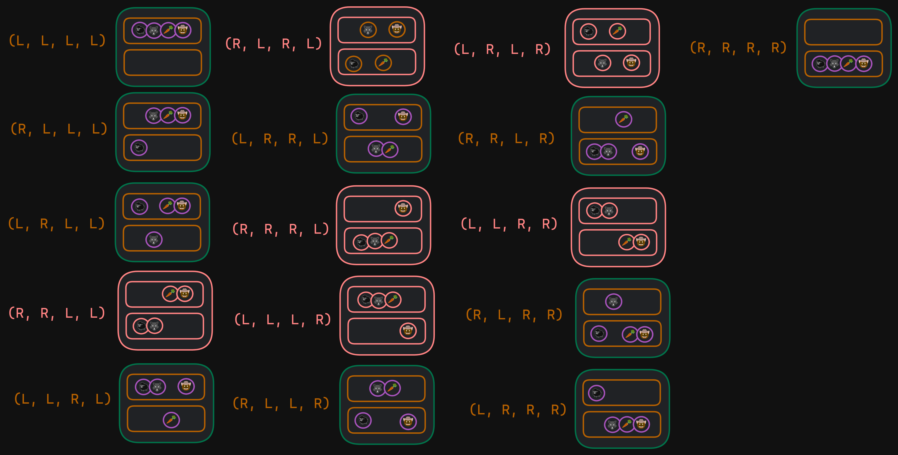

# Problema del Arriero

## Descripción del problema
El arriero tiene un lobo, una cabra y una lechuga, 
debe pasar a los animales al otro lado de un río,
pero solo puede llevar uno a la vez, y no puede dejar al lobo con la cabra, ni a la cabra con la lechuga. Solo puede cruzar una entidad a la vez.

## Descripción de la solucion
Se implemento un algoritmo de busqueda aleatoria, que genera estados aleatorios y verifica si son validos, si no lo son, se deshace el movimiento y se genera otro estado aleatorio, hasta que se encuentre un estado valido, o se hayan generado todos los estados posibles.



## Componenetes del codigo

Entity es una estructura que contiene la identidad y la posición de un objeto en el mapa.
```
type Entity struct {
	Identifier Identifier
	Position   Position
}
```
La lista de entidades se define como un arreglo de entidades, para definir el estado inicial.
```
var entities = []Entity{
	{Goat, Left},
	{Wolf, Left},
	{Carrot, Left},
	{Cowboy, Left},
}
```
La lista de estados imposibles, sirven para limitar las decisiones que se pueden tomar.
```
var entitiesAntiStates = [][]Entity{{
	{Goat, Right},
	{Wolf, Right},
	{Carrot, Left},
	{Cowboy, Left},
}, {
	{Goat, Right},
	{Wolf, Left},
	{Carrot, Right},
	{Cowboy, Left},
}, {
	{Goat, Right},
	{Wolf, Right},
	{Carrot, Right},
	{Cowboy, Left},
}, {
	{Goat, Left},
	{Wolf, Left},
	{Carrot, Left},
	{Cowboy, Right},
}, {
	{Goat, Left},
	{Wolf, Right},
	{Carrot, Left},
	{Cowboy, Right},
}, {
	{Goat, Left},
	{Wolf, Left},
	{Carrot, Right},
	{Cowboy, Right},
}}

```
La función `isAntiState` sirve para verificar si el estado actual es un estado imposible.
```
func isValidState(state []Entity) bool {
	for _, antiState := range entitiesAntiStates {
		if statesEqual(state, antiState) {
			return false
		}
	}
	return true
}

```
La funcion `moveEntity` sirve para mover una entidad de un lado a otro.
```
func moveEntity(entity *Entity) {
    if entity.Position == Left {
        entity.Position = Right
    } else {
        entity.Position = Left
    }
}
```
La funcion generateRandomValidMoves sirve para generar un estado aleatorio válido, mientras almacena lo movimientos anteriores en un stack.
```
func generateRandomValidMoves(state []Entity) ([]Entity, bool) {
	stack := make([][]Entity, 0) // Pila para almacenar estados
	stack = append(stack, state)

	for len(stack) > 0 {
		currentState := stack[len(stack)-1]
		stack = stack[:len(stack)-1]

		// Intentar realizar un movimiento aleatorio
		entityIndex := rand.Intn(len(currentState))
		moveEntity(&currentState[entityIndex])

		fmt.Println("Current state:")
		printState(currentState)

		// Verificar si el nuevo estado es válido
		if isValidState(currentState) {
			// Almacenar el nuevo estado en la pila
			stack = append(stack, currentState)
		} else {
			// Deshacer el movimiento no válido
			moveEntity(&currentState[entityIndex])
			fmt.Println("Invalid state, undoing move:")
			printState(currentState)
		}

		// Verificar si se ha encontrado un estado válido
		if isFinalState(currentState) {
			return currentState, true
		}
	}

	return nil, false
}

```
La funcion `isFinalState` sirve para verificar si el estado actual es el estado final.
```
func isFinalState(state []Entity) bool {
	// Implementa aquí una condición que determine si se ha alcanzado el estado final deseado
	// Por ejemplo, si todos los elementos están en el lado derecho
	for _, entity := range state {
		if entity.Position != Right {
			return false
		}
	}
	return true
}
```